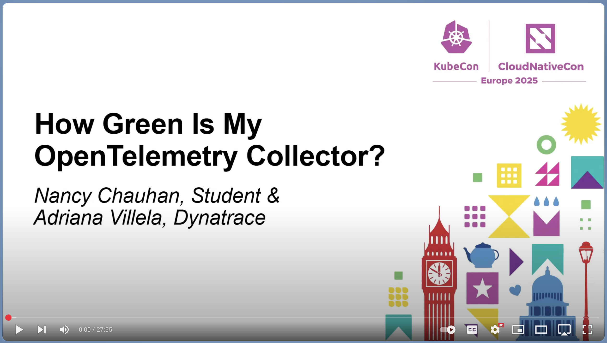

# How Green is My OTel Collector?

This is the accompanying repository for the "How Green is My OTel Collector?" KubeCon EU 2025 talk by Adriana Villela and Nancy Chauhan.

You can view the video on YouTube:

[](https://youtu.be/ea2CKLX5vEs?si=ajmH6sGf4zeKY4ZV)

This repository comes with a [Development (Dev) Container](https://containers.dev) [configuration file](.devcontainer/devcontainer.json), so that you can run the code locally using a Dev Container (e.g. via the [VSCode Dev Container plugn](https://marketplace.visualstudio.com/items?itemName=ms-vscode-remote.remote-containers)), or on [GitHub Codespaces](https://code.visualstudio.com/docs/remote/codespaces).

The Dev Container configuration includes everything that you need in order to run this example:
* `gcloud` CLI
* `pulumi` CLI
* Python v3.11
* [Helm](https://helm.sh/)
* `kubectl`
* [K9s](https://k9scli.io/)

Ideally, you should run this example using a cloud-based provider, to get a realistic idea of power consumption of cloud-based resources. This is nothing, however, stopping you from running this locally.

This repo will show you examples for running this with a cloud-based provider.

Reference repositories:
- https://github.com/henrikrexed/Sustainability-workshop/blob/master/deployment.sh
- https://github.com/Observe-Resolve/observeresolve-keplermetric/blob/master/deployment.sh


## Setup

### 1- Create Kubernetes cluster

#### Google Cloud Instructions:

Follow the instructions [here](/src/pulumi/gke-cluster/README.md). This will create a GKE cluster in Google Cloud using Pulumi.

If you're feeling less adventurous feel free to use the gcloud CLI:

```bash
# gcloud projects list
PROJECT_NAME=<your_project_name>
gcloud auth login
gcloud config set project ${PROJECT_NAME}$

# gcloud compute zones list
ZONE=<your_gcp_zone>
NAME=gke-kepler
MACHINE_TYPE=<your_machine_type>

# Create GKE cluster
gcloud container clusters create "${NAME}" \
  --zone ${ZONE} \
  --machine-type=${MACHINE_TYPE} \
  --num-nodes=1
```

#### AWS cloud Instructions : 

Setup your aws cli using `aws configure`.

#### Prerequisites for setting up an EKS cluster on AWS : 

Make sure the credentials/role that you're using to setup EKS, has the following permissions : 

```
AWSServiceRoleForAmazonEKS
AWSServiceRoleForAmazonEKSNodegroup
AmazonEC2ContainerServiceforEC2Role
AWSServiceRoleForECS
AmazonEKSClusterPolicy
AmazonEKSVPCResourceController
AmazonEKSAutoClusterRole
```

To create the EKS cluster, we would need to run the following commands :

**Step 1 :** 
- Install ekctl - https://eksctl.io/installation/#for-unix 

**Step 2:** 
- Setup env var in the terminal.
```bash
export CLUSTER_NAME="aws-otel-cluster" # the name of your cluster
export AWS_REGION="us-east-1" # you can choose any region you like
```

**Step 3:**
- Now run the following command to create the cluster.
```bash
eksctl create cluster \
  --name ${CLUSTER_NAME} \
  --region ${AWS_REGION} \
  --nodegroup-name standard-workers \
  --node-type t3.medium \
  --nodes 1 \
  --nodes-min 1 \
  --nodes-max 3 \
  --managed
```

**Step 4:**
- Update the kubeconfig to allow kubectl to access the cluster. 
```sh
aws eks --region ${AWS_REGION} update-kubeconfig --name ${CLUSTER_NAME}
```


### 2- Install the OpenTelemetry Operator

We will be collecting Prometheus metrics without Prometheus. Do do this, we will be leveraging the [OpenTelemetry Operator](https://opentelemetry.io/docs/platforms/kubernetes/operator/)'s TargetAllocator and the [OpenTelemetry Collector](https://opentelemetry.io/docs/collector/)'s [Prometheus Receiver](https://github.com/open-telemetry/opentelemetry-collector-contrib/tree/main/receiver/prometheusreceiver).


The script below deploys the [Prometheus Operator](https://github.com/prometheus-operator/prometheus-operator)'s [`PodMonitor`](https://prometheus-operator.dev/docs/user-guides/getting-started/#using-podmonitors) and [`ServiceMonitor`](https://prometheus-operator.dev/docs/operator/design/#servicemonitor) CRDs, and installs the OpenTelemetry Operator.

```bash
./src/scripts/01-install-otel-operator.sh
```

### 3 Install Kepler

This step will install Kepler and any additional components on your Kubernetes cluster.

#### Install Option 1 - No Prometheus

> 🚨 If you're using Dynatreace as a back-end use this script. Otherwise, go to [Install Option 2](#Install-Option-2--with-prometheus).

The [following script](/src/scripts/02-install-kepler.sh) will install [Kepler](https://sustainable-computing.io) via Helm. It will also install an updated `kepler-prometheus-exporter` `ServiceMonitor` with Prometheus scrape configs for Kepler. We do this here so we don't have to do it in the OTel Collector's Prometheus Receiver configuration. 

For more information, check out the [Kepler installation documentation](https://sustainable-computing.io/installation/kepler-helm/).

Run the script:

```bash
./src/scripts/03-install-podmonitor-svcmonitor.sh
./src/scripts/02-install-kepler.sh
```

#### Install Option 2 - With Prometheus

> 🚨 If you wish to also use Prometheus as a metrics backend with a Grafana dashboard, use this script. If you prefer to use the Dynatrace backend only for metrics, go to [Install Option 2](#Install-Option-1--no-prometheus).

The [following script](/src/scripts/02b-install-prom-and-kepler.sh) will install:

1. The [kube-prometheus-stack](https://github.com/prometheus-community/helm-charts/tree/main/charts/kube-prometheus-stack) via Helm.

    It includes the [Prometheus Operator](https://github.com/prometheus-operator/prometheus-operator), Grafana dashboards, and more.

2. [Kepler](https://sustainable-computing.io) via Helm.

    It will also install an updated `kepler-prometheus-exporter` `ServiceMonitor` with Prometheus scrape configs for Kepler. We do this here so we don't have to do it in the OTel Collector's Prometheus Receiver configuration. 

    Thanks to [Henrik Rexed](https://github.com/henrikrexed) for the [ServiceMonitor YAML definition](https://github.com/isItObservable/target-allocator/blob/master/kepler/serviceMonitor.yaml).

3. A [Grafana dashboard](/src/kepler/kepler_dashboard.json) for Kepler.

    For more information, check out the [Kepler installation documentation](https://sustainable-computing.io/installation/kepler-helm/).


Run the script: 

```bash
./src/scripts/02b-install-prom-and-kepler.sh
```
Open up a new terminal window to set up Kubernetes port-forwarding to access the Grafana dashboard.

```bash
export POD_NAME=$(kubectl --namespace prometheus get pod -l "app.kubernetes.io/name=grafana,app.kubernetes.io/instance=prometheus" -oname)
kubectl --namespace prometheus port-forward $POD_NAME 3000
```

Grafana will be available at http://localhost:3000. The username is `admin`. The default Grafana credentials are `admin/prom-operator`.

The dashboard will be accessible via `Dashboards > Kepler Exporter Dashboard`


### 4- Build and publish images to image registry (Optional)

This example runs a Python client and server app that have been instrumented with [OpenTelemetry](https://opentelemetry.io) via a combination of [code-based](https://opentelemetry.io/docs/concepts/instrumentation/code-based/) and [zero-code](https://opentelemetry.io/docs/concepts/instrumentation/zero-code/) instrumentation.

Instrumentation is sent to an [OpenTelemetry Collector](https://opentelemetry.io/docs/collector/), which is deployed via the [OpenTelemetry Operator for Kubernetes](https://opentelemetry.io/docs/platforms/kubernetes/operator/).

For more information on the application architecture, check out the [README](src/python/README.md).

If you would like to build container images of the example Python code yourself and deploy it to your own container registry, you are more than welcome to do so. Otherwise, feel free to skip this step and pull the images from my registry. 😁

The script in this section publishes the container images to the [GitHub Container Registry](https://docs.github.com/en/packages/working-with-a-github-packages-registry/working-with-the-container-registry).

Just make sure that you:

1. Replace `IMAGE_PREFIX` in [.env](/.env) with your own image registry information
2. Update `image` in [06-python-client.yaml](/src/k8s/06-python-client.yaml), [07-python-server.yaml](/src/k8s/07-python-app.yaml), and [08-python-app.yaml](/src/k8s/08-python-server.yaml) to reflect the correct image name.
3. Make the images public after publishing, otherwise you'll need to do [some additional configuration to pull images from a private registry](https://kubernetes.io/docs/tasks/configure-pod-container/pull-image-private-registry/).

Build and publish images:

```bash
GH_TOKEN="<your_github_access_token>"
GH_USERNAME="<your_github_username>"

./src/scripts/04-build-and-publish-images.sh $GH_TOKEN $GH_USERNAME
```

### 5- Deploy to Kubernetes

This will deploy the exmaple Python code (client and server app), plus a Python app that emits Prometheus-style metrics. It will also deploy an `OpenTelemetryCollector` resource, which deploys an OpenTelmetry Collector and Target Allocator.

#### Deploy Option 1 - No Prometheus

> 🚨 If you're using Dynatreace as a metrics back-end only use this script. Otherwise, go to [Deploy Option 2](#Deploy-Option-2--with-prometheus).

Note that you will also need to do some additional configuration, as documented [here](https://github.com/avillela/otel-target-allocator-talk?tab=readme-ov-file#3b--kubernetes-deployment-with-dynatrace-backend).

Deploy the manifests:

```bash
# Send telemetry to Dynatrace using a single Collector using the collector-contrib image
./src/scripts/05-deploy-resources.sh --run-mode dt --split-collectors nosplit

# Send telemetry to Dynatrace using a single Collector using an image built with the OpenTelemetry Collector Builder
./src/scripts/05-deploy-resources.sh --run-mode dt --split-collectors nosplitocb

# Send telemetry to Dynatrace using a one Collector for k8s telemetry, and another Collector for application telemetry, both using 
# the collector-contrib image
./src/scripts/05-deploy-resources.sh --run-mode dt --split-collectors split
```

Once the Python app has been running for a while, you'll be able to view the OTel Collector's energy consumption in Dynatrace. Log on to Dynatrace by going to https://dynatrace.com.

Next, open up the [Dynatrace Dashboards app](https://docs.dynatrace.com/docs/analyze-explore-automate/dashboards-and-notebooks/dashboards-new) and [upload](https://docs.dynatrace.com/docs/analyze-explore-automate/dashboards-and-notebooks/dashboards-new/get-started/dashboards-manage#dashboards-upload) the [Dynatrace Kepler Dashboard](/src/kepler/dynatrace_kepler_dashboard.json).


#### Deploy Option 2 - With Prometheus

> 🚨 If you're using Jaeger and Prometheus as a backend with a Grafana dashboard, use this script. If you prefer to use the Dynatrace backend, go to [Deploy Option 1](#Deploy-Option-1--no-prometheus).

Deploy the manifests

```bash
./src/scripts/05-deploy-resources.sh --run-mode oss --split-collectors nosplit
```

Next, open up Jaeger. You'll need to first up a new terminal window, and set up port-forwrading.

```bash
kubectl port-forward svc/otel-jaeger-query -n opentelemetry 16686:16686
```

Jaeger will be available at http://localhost:16686.


Once the Python app has been running for a while, you'll be able to view the OTel Collector's energy consumption.

Go to Grafana at http://localhost:3000, and naviagate to `Dashboards > Kepler Exporter Dashboard`.

Next, select `otelcol-collector-0` from the `Pod` dropdown, to view the power consumption and carbon emissions of your Collector.


### 6- Deploy kube-green

Install kube-green

```bash
./src/scripts/06-install-kube-green.sh
```

Apply the sleep info

```bash
kubectl apply -f src/k8s/10-sleep-info.yaml
```

## Useful Commands

### Nukify

Nukify resoruces from the Kubernetes cluster without nukifying the cluster itself.

```bash
# Uninstall Kepler
helm delete kepler --namespace kepler

# Uninstall Kube Prometheus Stack
helm delete prometheus --namespace prometheus
```

### OTel Collector goodies

Tail OTel Collector logs:

```bash
kubectl logs -l app.kubernetes.io/component=opentelemetry-collector -n opentelemetry --follow
```

List metrics (mostly):

```bash
kubectl logs otelcol-collector-0 -n opentelemetry | grep "Name:" | sort | uniq
```

## Resources & References

* [Engineers often need a lot of water to keep data centers cool](https://www.asce.org/publications-and-news/civil-engineering-source/civil-engineering-magazine/issues/magazine-issue/article/2024/03/engineers-often-need-a-lot-of-water-to-keep-data-centers-cool)
* [kube-green (article on Medium)](https://medium.com/@rahul.mam/kube-green-c04358881a2f)
* [Kube-green: An operator to reduce CO2 footprint of your kubernetes clusters (article on Medium)](https://purushothamkdr453.medium.com/kube-green-an-operator-to-reduce-co2-footprint-of-your-clusters-b09643eb9ed2)
* [Keeping the Cloud Green with the kube-green Operator on OpenShift](https://www.redhat.com/en/blog/keeping-the-cloud-green-with-the-kube-green-operator-on-openshift)
* [Green Reviews Working Group: Moving towards measuring the sustainability footprint of CNCF projects](https://tag-env-sustainability.cncf.io/blog/2024-green-reviews-working-group-measuring-sustainability/)
* [green-reviews-tooling (repository on GitHub)](https://github.com/cncf-tags/green-reviews-tooling?tab=readme-ov-file)
* [Observe & Resolve: KubeGreen (repository on GitHub)](https://github.com/Observe-Resolve/kubegreen/blob/master/deployment.sh)
* [Kube-Green Project](https://kube-green.dev/docs/getting-started/)
* [Daily Clean](https://github.com/AxaFrance/dailyclean)
* [Sustainability Workshop](https://github.com/henrikrexed/Sustainability-workshop)
* [Observe & Resolve: Kepler Metrics](https://github.com/Observe-Resolve/observeresolve-keplermetric)
* [OTel Collector internal telemetry](https://opentelemetry.io/docs/collector/internal-telemetry/)
* [Ultimate Guide to Observing Your OpenTelemetry Collector](https://isitobservable.io/open-telemetry/ultimate-guide-to-observing-your-opentelemetry-collector)
* [OTel Collector Cookbook](https://github.com/jpkrohling/otelcol-cookbook)
* [OTel Collector Config API reference](https://github.com/open-telemetry/opentelemetry-configuration/blob/main/examples/sdk-config.yaml#L157)
* [Workaround for getting `temporality_preference` config to get picked up in internal Collector telemetry (metrics)](https://github.com/open-telemetry/opentelemetry-collector/issues/13080)